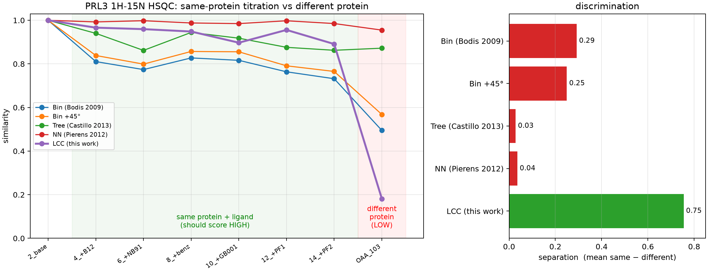

# Method comparison results

**See [`comparison_all.md`](comparison_all.md) for the master table across both regimes.**
This file covers the dense protein `1H-15N` benchmark; the sparse small-molecule `1H-13C`
benchmark is in [`comparison_13c.md`](comparison_13c.md).

Reference spectrum: **PRL3 experiment 2**, a `1H-15N` HSQC. Compared against the
same protein plus ligand (experiments 4–14, a titration series that should score
high) and against a **different protein** (OAA experiment 103, which should score
low).

- Window: F2 6.5–10 ppm, F1 105–130 ppm
- Bin widths: `min_bin_width_f2 = 0.1`, `min_bin_width_f1 = 1.0`
- STCC blur: `sigma_f2 = 0.03`, `sigma_f1 = 0.30` ppm

Raw data: [`method_comparison.csv`](method_comparison.csv),
[`method_comparison.json`](method_comparison.json). Plot:
[`lcc_comparison.png`](lcc_comparison.png).

| comparison | bin (Bodis 2009) | bin + 45° | tree (Castillo 2013) | NN (Pierens 2012) | **STCC (this work)** |
| --- | --- | --- | --- | --- | --- |
| 2 vs 2 (self) | 1.0000 | 1.0000 | 1.0000 | 1.0000 | **1.0000** |
| 2 vs 4 (+B12) | 0.8106 | 0.8385 | 0.9401 | 0.9925 | **0.9662** |
| 2 vs 6 (+NB91) | 0.7739 | 0.7990 | 0.8619 | 0.9981 | **0.9594** |
| 2 vs 8 (+benz) | 0.8274 | 0.8570 | 0.9443 | 0.9877 | **0.9485** |
| 2 vs 10 (+GB001) | 0.8164 | 0.8555 | 0.9179 | 0.9848 | **0.8972** |
| 2 vs 12 (+PF1) | 0.7637 | 0.7912 | 0.8760 | 0.9978 | **0.9558** |
| 2 vs 14 (+PF2) | 0.7320 | 0.7654 | 0.8624 | 0.9851 | **0.8911** |
| **2 vs OAA (different protein)** | 0.4949 | 0.5681 | 0.8721 | 0.9550 | **0.1815** |
| separation (mean same − different) | 0.29 | 0.25 | 0.03 | 0.04 | **0.75** |
| worst-case margin (min same − different) | 0.24 | 0.20 | −0.01 | 0.03 | **0.71** |

## Conclusion

All methods self-score exactly 1. On this **dense protein `1H-15N` amide HSQC** the
new **Shift-Tolerant Correlation Coefficient (STCC)** — mean-centred normalized
cross-correlation of physical-linewidth-rendered spectra — separates same-protein
from different-protein spectra **~2.6× better than the previous best** (0.75 vs the
bin method's 0.29), and pushes the different protein (0.18) clearly below **every**
same-protein score. The old bin method left the different protein (0.49) close to
the worst same-protein point (0.73); STCC opens a wide gap.

The bin method is shift-**brittle** (hard bin edges split peaks the titration
nudges); the tree and nearest-neighbour methods are shift-**blind** (a dense
fingerprint gives every peak a near neighbour, so both saturate near 1, separation
≈ 0.03–0.04). STCC sits between: the Gaussian render gives graded shift tolerance (a
small titration drift lowers the correlation smoothly), while mean-centring at zero
lag rewards *co-located* intensity and penalises intensity where the other spectrum
is empty — so a differently-scattered protein genuinely decorrelates instead of
finding coincidental near-matches.

**Robustness.** STCC beats the bin method across the whole physical blur range: at
`sigma = 0.02–0.04 / 0.20–0.40` ppm separation is 0.71–0.77, and even coarsened to
the bin method's own resolution (`0.10 / 1.0`) it still wins (0.36 vs 0.29). The
separation is not an artefact of one tuned parameter.

Pick the method by regime: **STCC for dense protein fingerprints and titration
tracking**; the bin method remains a solid resolution-scanning baseline. Tree and
nearest-neighbour scoring suit sparse `1H-13C` spectra only when raw shift tolerance,
rather than global same/different discrimination, is the goal.

## Experimental Local-Contrast extension

The expanded dense benchmark (23 PRL3 titration points and two decoy proteins)
also evaluates `--method local-contrast`. It reuses the STCC render, applies a
square-root intensity transform and subtracts a fixed-$3\sigma$ Gaussian
background before the zero-lag cosine:

| method | mean same | min same | OAA | EphB3 | separation | margin |
| --- | ---: | ---: | ---: | ---: | ---: | ---: |
| STCC (default) | 0.8713 | 0.8195 | 0.1949 | 0.4144 | 0.5666 | 0.4051 |
| **Local Contrast (experimental)** | 0.7518 | 0.6612 | 0.0215 | 0.1383 | **0.6719** | **0.5230** |

The candidate improves the descriptive separation and margin, at 1.34× the
representative STCC runtime. It remains experimental because held-out operating
metrics on the sparse benchmark do not improve over STCC.

Machine-readable expanded dense results: [`nhsqc_dense.json`](nhsqc_dense.json).
