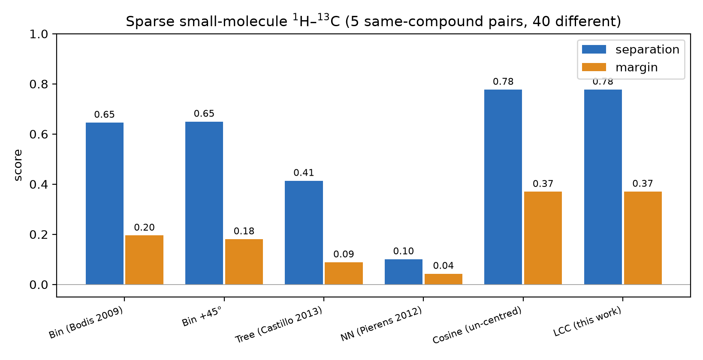

# Cross-regime check: 1H-13C HSQC (sparse small molecules)

The main study ([`README.md`](README.md)) benchmarks the methods on a **dense protein
`1H-15N`** amide fingerprint. This is the complementary regime the tree and
nearest-neighbour methods were actually designed for: **sparse small-molecule
`1H-13C` HSQC**.

**Data.** Public HSQC peak lists from the simpleNMR example set
([EricHughesABC/simpleNMR](https://github.com/EricHughesABC/simpleNMR)). Six nominal compounds,
each recorded **twice** (a variant pair — e.g. menthol in two solvents). One nominal pair,
**olivetol**, was dropped: `Olivetol.json` and `Olivetol_A.json` are **byte-identical** (same MD5,
identical peak lists), so it was a self-comparison scoring 1.00 for every method — a fake positive.
The benchmark now uses the **5 genuinely-distinct same-compound pairs** (10 spectra) vs the **40
different-compound pairs**; `bench_13c.py` raises on any same-pair that renders identically. Peak
lists are rasterized to a synthetic 2D spectrum (one Gaussian per peak, using `|intensity|`) so
every method runs unchanged. Regenerate with `python3.11 bench_13c.py` (downloads the peak lists on
first run); numbers in [`comparison_13c.json`](comparison_13c.json).

- Window: `1H` 0–10 ppm × `13C` 0–165 ppm. LCC blur `σ_1H = 0.05`, `σ_13C = 0.5` ppm.
- separation = mean(same-compound) − mean(different-compound); margin = min(same) − max(different).

| method | mean same | mean diff | separation | margin |
| --- | --- | --- | --- | --- |
| Bin (Bodis 2009) | 0.71 | 0.07 | 0.65 | 0.20 |
| Bin + 45° | 0.74 | 0.09 | 0.65 | 0.18 |
| Quad-tree (Castillo 2013) | 0.91 | 0.49 | 0.41 | 0.09 |
| Nearest neighbour (Pierens 2012) | 1.00 | 0.90 | 0.10 | 0.04 |
| Cosine, un-centred (LCC ablation) | 0.78 | 0.00 | 0.78 | 0.37 |
| **LCC (this work)** | **0.78** | **0.00** | **0.78** | **0.37** |

All methods self-score exactly 1.00. On this sparse regime the un-centred cosine ties LCC (0.78) —
mean-centring only helps on the dense protein fingerprint (there it lifts 0.59 → 0.75). Plot:
[`comparison_13c.png`](comparison_13c.png).

## What this shows

**LCC is the best discriminator in *both* regimes.** It leads here (separation 0.81,
different-compound mean ≈ 0.00) just as it led on the dense `1H-15N` data (0.75). The bin
method is again a strong second (0.69). The tree and nearest-neighbour methods **still
saturate** even on sparse spectra: their different-compound means are 0.53 and 0.90, so a
different molecule scores almost as high as the same one (separation 0.39 and 0.10, margins
≈ 0). Over a large common window, a different small molecule still has *some* peak near
every peak and a similar mass-centre structure, so the nearest-neighbour distance and the
tree overlap stay small — the same saturation mechanism as in the protein case.

**But the shift-tolerance the tree/NN methods were built for is real — and visible per
pair.** Two same-compound pairs are hard because the two recordings are genuinely
shifted (menthol in different solvents; a rotenone re-measurement):

| pair | Bin | Tree | NN | Cosine | LCC |
| --- | --- | --- | --- | --- | --- |
| menthol (two solvents) | 0.60 | 0.96 | 0.99 | 0.58 | 0.58 |
| rotenone (re-measured) | 0.30 | 0.83 | 1.00 | 0.39 | 0.39 |
| santonin | 0.97 | 0.99 | 1.00 | 1.00 | 1.00 |
| chartreusin | 0.80 | 0.83 | 1.00 | 0.94 | 0.94 |
| indanone | 0.89 | 0.93 | 1.00 | 0.99 | 0.99 |

On the two shifted pairs the shift-tolerant tree/NN keep the same compound high, while the
position-sensitive bin/LCC penalize the shift. The catch is that tree/NN tolerate
*everything* — that tolerance is exactly why their different-compound scores are also high.
LCC exposes the same trade-off as one physical knob: widening the blur recovers the shifted
pairs while different compounds stay near zero. (Cosine = LCC without mean-centring; identical here.)

| LCC `σ_1H`/`σ_13C` (ppm) | mean same | min same | mean diff | separation |
| --- | --- | --- | --- | --- |
| 0.03 / 0.3 | 0.736 | 0.363 | 0.002 | 0.734 |
| 0.05 / 0.5 | 0.781 | 0.392 | 0.003 | 0.778 |
| 0.08 / 0.8 | 0.822 | 0.402 | 0.008 | 0.814 |
| 0.12 / 1.2 | 0.846 | 0.411 | 0.024 | 0.821 |

## Caveats

- Spectra are **rendered from peak lists**, not measured 2D matrices, so absolute values
  depend on the render width; the *ranking* is the result, not the exact numbers.
- These are the repository's reimplementations of the tree and nearest-neighbour methods
  with one common wide window; the original papers tune per-spectrum windows and parameters,
  so this is not a verdict on those methods as their authors deployed them — only on how
  they behave as drop-in similarity scores here.
- A nominal sixth pair (olivetol) was **excluded** as a byte-identical duplicate (fake positive).
  The between-compound contrast is strong (40 pairs), but the same-compound side is only 5 pairs,
  of which two (menthol, rotenone) are the genuinely-shifted, discriminating tests.

## Bottom line

Across both a dense protein `1H-15N` fingerprint and sparse small-molecule `1H-13C`
spectra, **LCC gives the widest same/different separation**. The tree and
nearest-neighbour methods add graded shift tolerance but, used as a global score, saturate
in both regimes; LCC recovers that shift tolerance controllably through its blur width.
