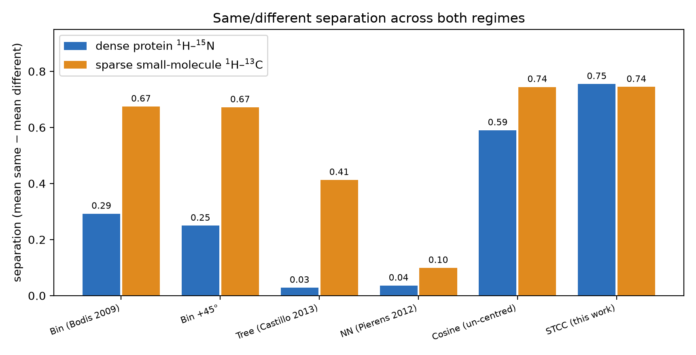

# Master comparison: both regimes at a glance

Separation is mean same − mean different; margin is worst same − best
different. Higher is better; every method self-scores exactly 1.00.

## Primary method comparison

The dense column is the original PRL3 single-decoy benchmark. The sparse column
uses the current stick-input protocol with 5 same-compound and 40
different-compound pairs.

| method | dense `1H-15N` sep | margin | sparse `1H-13C` sep | margin |
| --- | ---: | ---: | ---: | ---: |
| Bin (Bodis 2009) | 0.292 | 0.237 | 0.675 | 0.212 |
| Bin + 45° | 0.250 | 0.197 | 0.672 | 0.194 |
| Quad-tree (Castillo 2013) | 0.028 | −0.010 | 0.413 | 0.069 |
| Nearest neighbour (Pierens 2012) | 0.036 | 0.030 | 0.099 | 0.041 |
| Cosine, un-centred (STCC ablation) | 0.590 | — | 0.744 | 0.373 |
| **STCC (default)** | **0.755** | **0.710** | **0.745** | **0.374** |

Among the primary methods, STCC gives the strongest separation in both regimes.
Mean-centring matters in the crowded dense fingerprint (0.590→0.755) but changes
little on sparse sticks (0.744→0.745).

## Experimental Local-Contrast extension

Local Contrast is evaluated on the expanded dense benchmark (23 titration points,
two decoys) and the same sparse stick benchmark:

| benchmark | STCC sep / margin | Local Contrast sep / margin |
| --- | ---: | ---: |
| Dense: 23 same + 2 decoys | 0.5666 / 0.4051 | **0.6719 / 0.5230** |
| Sparse: 5 same + 40 different | 0.7447 / 0.3736 | **0.8203 / 0.4336** |

The candidate improves descriptive separation and margin in both examples. Its
sparse compound-cluster paired gain over STCC is 0.0757 (95% CI
0.0014–0.2057), but AUROC/AUPRC/top-1/MRR remain 1.00 and both methods retain
zero leave-one-compound-out threshold error and rejection FPR. It therefore
remains experimental; `--method lcc` remains the default.

Details:

- Dense original and expanded results: [`README.md`](README.md)
- Sparse aggregate, per-pair and held-out results:
  [`comparison_13c.md`](comparison_13c.md)
- Machine-readable sparse values: [`comparison_13c.json`](comparison_13c.json)
